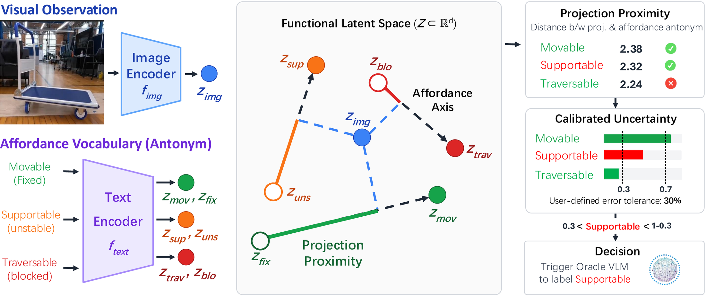
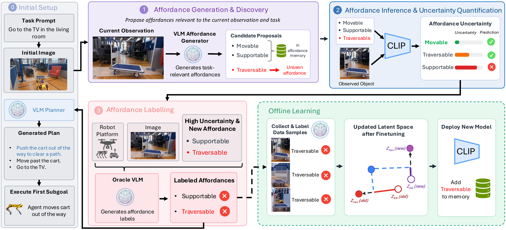
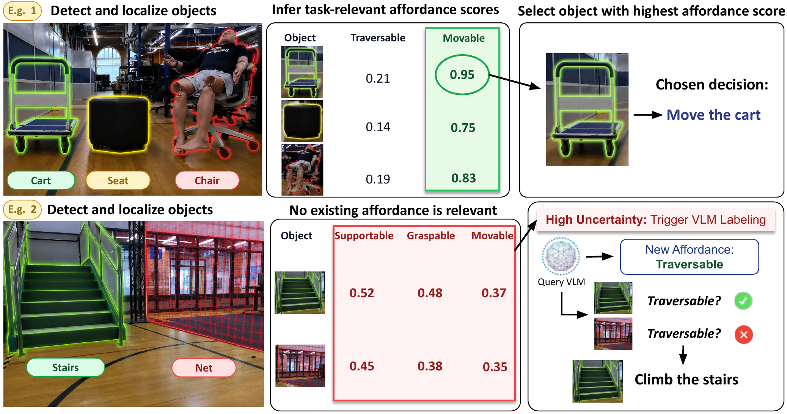
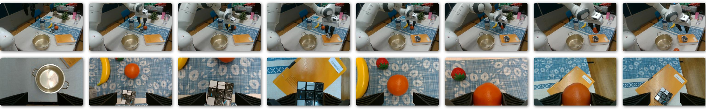

# What Objects Enable, Not What They Are: Functional Latent Spaces for Affordance Reasoning

<p align="center">
    <a href="https://rohan-siva.github.io/">Rohan Siva</a><sup>1,*</sup>
    ·
    <a href="https://neel1302.github.io/">Neel P. Bhatt</a><sup>1,2,*</sup>
    ·
    <a href="https://yunhaoyang234.github.io/">Yunhao Yang</a><sup>1,2,*</sup>
    ·
    <a href="https://www.linkedin.com/in/seoyoung-lee-8b4036177/">Seoyoung Lee</a><sup>1</sup>
    ·
    <a href="https://www.linkedin.com/in/nishant-gadde/">Nishant Gadde</a><sup>1</sup>
    <br>
    <a href="https://www.linkedin.com/in/christian-ellis-research/">Christian Ellis</a><sup>1,2</sup>
    ·
    <a href="https://www.linkedin.com/in/alvaro-velasquez-b14963246/">Alvaro Velasquez</a><sup>2,3</sup>
    ·
    <a href="https://express.adobe.com/page/CAdrFMJ9QeI2y/">Zhangyang Wang</a><sup>1</sup>
    ·
    <a href="https://www.ae.utexas.edu/people/faculty/faculty-directory/topcu">Ufuk Topcu</a><sup>1,2</sup>
    <br>
    <sup>1</sup>The University of Texas at Austin &nbsp;&nbsp; <sup>2</sup>Neurosymbolic Intelligence &nbsp;&nbsp; <sup>3</sup>University of Colorado Boulder
    <br>
    <em>*Equal Contribution</em>
    <br>
    <b><i>CoRL 2026</i></b>
    <h3 align="center">
        <a href="https://a4dance-reasoning.github.io/">Project Page</a> |
        <a href="https://arxiv.org/abs/2606.05533">arXiv</a> |
        <a href="https://huggingface.co/datasets/rohansiva/A4D-dataset">Dataset</a> |
        <a href="https://huggingface.co/rohansiva/A4D-Checkpoint">Model Checkpoint</a>
    </h3>
</p>

---

## TL;DR

A4D reasons about **what objects enable, not what they are** — mapping visual observations into a functional latent space structured around affordances (e.g., "movable") instead of appearance-based categories, and **discovering new affordances** when existing ones aren't enough. A4D achieves **94% inference accuracy** on existing affordances (+15 points over SOTA VLMs), improves new-affordance inference from **70% to over 90%** with fewer than 10% of the original training data, and enables **100x faster** inference.

---

## Framework Overview



**Functional Latent Space for Affordance Reasoning.** A4D maps visual observations and affordance descriptions into a shared functional latent space. For each affordance, we construct an affordance axis between an affordance and its antonym (e.g., movable ↔ fixed). Visual observations are projected onto these axes to infer task-relevant object functionalities. Projection proximity is calibrated into uncertainty estimates, enabling the system to identify when additional reasoning is required.



**Uncertainty-Aware Affordance Discovery.** Given a task and visual observation, A4D first generates candidate affordances relevant to the current planning problem. Affordance inference is performed in the functional latent space, while calibrated uncertainty determines whether existing affordances are sufficient. When uncertainty is high or a new functionality is required, a vision-language model proposes and labels new affordances, which are incorporated through offline learning and added to the affordance memory for future deployment.

## Demonstrations



A4D performs affordance-based decision making across diverse scenarios. In the first example, the planner selects the cart as the most movable object for the task. In the second example, existing affordances are insufficient, triggering uncertainty-guided affordance discovery and introducing a new traversable affordance to successfully complete the task.



A4D transfers across robot platforms and domains. The same affordance generation, inference, and discovery framework is deployed on a tabletop robot arm, demonstrating that affordance reasoning is not tied to a specific robot platform. By conditioning generation and labeling on platform-specific capabilities, A4D adapts affordance predictions to new robots and tasks without modifying the underlying framework.

## Setup

```bash
pip install -r requirements.txt
export OPENAI_API_KEY="your_api_key_here"  # only needed for affordance_generation.ipynb
```

## Demos

1. [`affordance_generation.ipynb`](affordance_generation.ipynb) — open-vocabulary affordance discovery with a VLM.
2. [`classification_uncertainty.ipynb`](classification_uncertainty.ipynb) — CLIP-based affordance classification with calibrated uncertainty.

## Model Checkpoint

Fine-tuned CLIP checkpoint on Hugging Face: [rohansiva/A4D-Checkpoint](https://huggingface.co/rohansiva/A4D-Checkpoint). Downloaded automatically by `classification_uncertainty.ipynb` if not present locally.

## Dataset

552 labeled images across 29 object classes and 10 affordances: [rohansiva/A4D-dataset](https://huggingface.co/datasets/rohansiva/A4D-dataset). A local copy also lives in [`dataset/`](dataset).

## Citation

If you find this work interesting and use it in your research, please consider citing our paper.

```bibtex
@inproceedings{siva2026objectsenablearefunctional,
            title={What Objects Enable, Not What They Are: Functional Latent Spaces for Affordance Reasoning},
            author={Rohan Siva and Neel P. Bhatt and Yunhao Yang and Seoyoung Lee and Nishant Gadde and Christian Ellis and Alvaro Velasquez and Zhangyang Wang and Ufuk Topcu},
            year={2026},
            booktitle={Proceedings of the Tenth Conference on Robot Learning},
            address={Austin, TX, USA},
            publisher={PMLR},
      }
```
